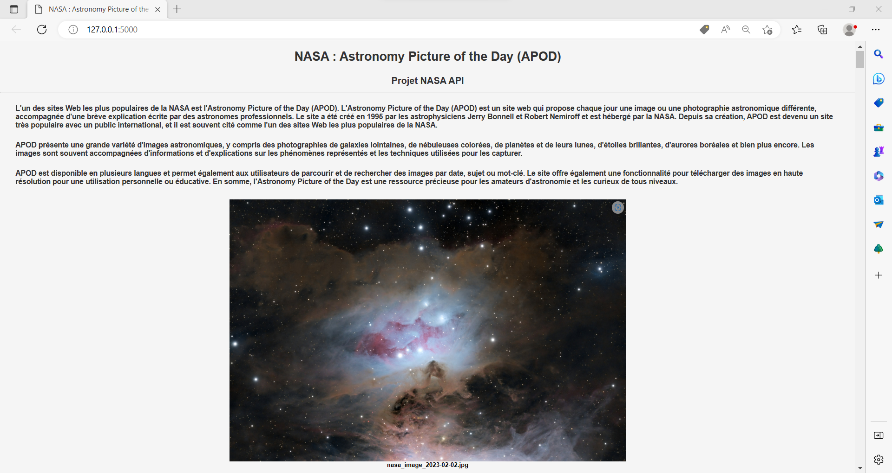

# Projet NASA API : Création d'une application Web avec Flask


## Introduction

### Description du la NASA
La NASA, l'Agence spatiale américaine, est une agence gouvernementale qui est responsable de la recherche et du développement de programmes spatiaux pour les États-Unis d'Amérique. Elle a été créée en 1958 en réponse au lancement du premier satellite artificiel de la Terre, le Spoutnik, par l'Union soviétique en 1957.

La NASA a pour mission de mener des recherches et de développer des technologies pour explorer l'espace et faire progresser la science aéronautique. Elle a également pour mission d'étudier et de surveiller la Terre et son environnement, ainsi que de promouvoir l'éducation en sciences et en technologie.

La NASA a réalisé de nombreuses missions historiques, notamment la première marche de l'homme sur la Lune en 1969 lors de la mission Apollo 11. Depuis lors, la NASA a envoyé des missions pour explorer les planètes du système solaire, les étoiles et les galaxies lointaines. Elle a également développé des technologies pour la surveillance de la Terre, telles que les satellites météorologiques, les satellites d'observation de la Terre et les missions de recherche sur l'environnement.

La NASA travaille en collaboration avec d'autres agences spatiales et organisations à travers le monde pour réaliser des missions d'exploration de l'espace et de la Terre. Elle est également impliquée dans la formation et la collaboration avec les entreprises privées pour développer des technologies spatiales et pour effectuer des missions spatiales commerciales.

La NASA continue de jouer un rôle important dans la recherche et la découverte de l'espace et de la Terre, et elle continue d'inspirer des générations à poursuivre des carrières en sciences, en technologie, en ingénierie et en mathématiques.


### Description de l'API de la NASA
L'API de la NASA est une interface de programmation d'application qui permet aux développeurs de logiciels d'accéder à des données et à des informations sur les missions, les satellites, les astéroïdes, les planètes, les étoiles et autres objets dans l'espace. L'API de la NASA fournit un accès à une variété de données et d'images, y compris des images de l'espace, des données climatiques, des informations sur les missions spatiales passées et présentes, etc. Les développeurs peuvent utiliser ces données pour créer des applications, des visualisations et des outils pour le grand public ou pour des applications scientifiques plus avancées.

L'API de la NASA est disponible gratuitement pour une utilisation publique et commerciale, et elle est maintenue par la NASA elle-même. Les développeurs doivent créer un compte pour obtenir une clé API pour accéder aux données de l'API. La documentation de l'API de la NASA fournit des informations sur les différents points d'extrémité, les paramètres de la requête et les types de données disponibles pour les développeurs.

L'utilisation de l'API de la NASA permet aux développeurs de créer des applications éducatives, des outils de visualisation, des applications mobiles et des jeux basés sur l'espace, ainsi que des applications scientifiques pour l'étude des données spatiales et leur intégration dans des systèmes de surveillance terrestres.


### Description de APOD
L'un des sites Web les plus populaires de la NASA est [l'Astronomy Picture of the Day (APOD)](https://apod.nasa.gov/apod/astropix.html). L'Astronomy Picture of the Day (APOD) est un site web qui propose chaque jour une image ou une photographie astronomique différente, accompagnée d'une brève explication écrite par des astronomes professionnels. Le site a été créé en 1995 par les astrophysiciens Jerry Bonnell et Robert Nemiroff et est hébergé par la NASA. Depuis sa création, APOD est devenu un site très populaire avec un public international, et il est souvent cité comme l'un des sites Web les plus populaires de la NASA.

APOD présente une grande variété d'images astronomiques, y compris des photographies de galaxies lointaines, de nébuleuses colorées, de planètes et de leurs lunes, d'étoiles brillantes, d'aurores boréales et bien plus encore. Les images sont souvent accompagnées d'informations et d'explications sur les phénomènes représentés et les techniques utilisées pour les capturer.

APOD est disponible en plusieurs langues et permet également aux utilisateurs de parcourir et de rechercher des images par date, sujet ou mot-clé. Le site offre également une fonctionnalité pour télécharger des images en haute résolution pour une utilisation personnelle ou éducative. En somme, l'Astronomy Picture of the Day est une ressource précieuse pour les amateurs d'astronomie et les curieux de tous niveaux.

La documentation complète de cette API est disponible dans le [repository Github de l'API APOD](https://github.com/nasa/apod-api) .


### Description du Projet
Le projet "NASA API : Création d'une application Web avec Flask" consiste à développer une application Web utilisant Flask, un framework Python, pour récupérer les images de la NASA à partir de l'API publique de la NASA et les afficher sur le site Web. Le projet vise à permettre aux utilisateurs de naviguer et de visualiser les images de la NASA d'une manière plus intuitive et interactive.

Le projet comprend plusieurs étapes, notamment la configuration de l'environnement de développement, l'installation des dépendances et des bibliothèques, la mise en place d'un serveur local Flask, la récupération des images de la NASA à partir de l'API de la NASA, et leur affichage sur le site Web.

Le projet implique également la manipulation des images récupérées, telles que le redimensionnement ou le recadrage, ainsi que l'enregistrement des images localement.

En fin de compte, le projet vise à fournir aux utilisateurs une expérience visuelle agréable pour naviguer à travers les images de la NASA et en apprendre davantage sur les activités de la NASA et les événements récents de l'espace.


## Information du projet

- Contributeur du projet : Antonin
- Date de la dernière mise à jour : 04 mars 2023


## Installation

### Prérequis du projet
- Création d'un compte sur le sur site [https://api.nasa.gov/](https://api.nasa.gov/) afin d'obtenir la clé d'API pour accéder à l'API de la NASA.
- [Python](https://www.python.org/downloads/)
- [flask](https://pypi.org/project/Flask/)
- Librairie python : requests
- Librairie python : os
- Librairie python : shutil


### Obtenir une clé API de la NASA 
- Rendez-vous sur le site web de la NASA Open APIs à l'adresse [https://api.nasa.gov/](https://api.nasa.gov/).
- Cliquez sur le bouton "Generate API Key" en haut à droite de la page.
- Si vous n'avez pas déjà de compte, créez un compte en fournissant vos informations personnelles (First Name, Last Name et Email).
- Après avoir créé un compte, votre clé API sera générée et vous recevrez par mail la clé API de la NASA. Copiez-la et gardez-la en lieu sûr.
- Utilisez votre clé API pour accéder aux données et aux fonctionnalités de l'API de la NASA.

### Projet sur Git
Le projet est disponible sur le site [Github](https://github.com/) sur le lien : [https://github.com/antoningr/API_NASA](https://github.com/antoningr/API_NASA). 


### Téléchargement du projet
- Ouvrez votre terminal ou invite de commandes.
- Allez dans le répertoire où vous souhaitez enregistrer le projet.
- Tapez la commande suivante pour cloner le projet depuis le dépôt Git :
```
git clone https://github.com/antoningr/API_NASA.git
```
- Appuyez sur "Entrée" pour lancer la commande. Git va alors télécharger le projet dans le répertoire actuel.


### Packages python du projet
Avant d'exécuter le projet, il faut s'assurer d'avoir tous les packages python soit correctement installé avec les bonnes versions pour pouvoir exécuter cette application. 
- Ouvrez votre terminal ou invite de commandes.
- Accédez au répertoire du projet à l'aide de la commande cd.
- Installez les packages et les dépendances Python répertoriés dans le fichier requirements.txt, utilisez la commande suivante :
```
pip install -r requirements.txt
```
- Une fois l'installation terminée, vous pouvez exécuter le projet.

### Configuration du fichier config.py du projet
Modifier le fichier de configuration config.py dans le répertoire principal du projet et ajoutez-y votre clé d'API de la NASA et les paramètres de la requête tels que la date, la date de début, la date de fin et le nombre d'images à récupérer. 
Voici un exemple de configuration :
```
# Clé API pour accéder à l'API de la NASA à remplir
api_key = "sJFjHbJ7jjK97jpjdUJvFN8ndpYH5ubnGDhdYOdpo"

# Date de début pour récupérer les images
start_date="2023-02-02"

# Date de fin pour récupérer les images
end_date="2023-02-05"

# Nombre d'images à récupérer
count=None

# Récupérer les images en taille réduite
thumbs="True"
```

### Exécution de l'application
Après que le projet soit correctement installée avec tous les paquets et dépendances nécessaires, vous pouvez suivre ces instructions pour l'exécuter l'application web :
- Ouvrez une invite de commande ou une fenêtre de terminal.
- Naviguez vers le répertoire racine de l'application où se trouve le fichier app.py.
- Exécutez la commande suivante pour démarrer l'application web :
```
python app.py
```
- Si l'application démarre correctement, vous devriez voir une sortie similaire à celle qui suit :
```
* Exécution sur http://127.0.0.1:5000/ (Appuyez sur CTRL+C pour quitter)
```
- Ouvrez un navigateur Web, l'application web est accessible à l'adresse [http://127.0.0.1:5000](http://127.0.0.1:5000).
- L'application web devrait maintenant fonctionner et être accessible via un navigateur Web.


### Utilisation de l'application

À partir d'un navigateur Web, l'application web est accessible à l'adresse [http://127.0.0.1:5000](http://127.0.0.1:5000).
L'utilisateur peut maintenant naviguer entre les différentes pages et fonctionnalités de l'application web.


## Fonctionnalité de l'application web

### Page d'accueil de l'application
La page d'accueil de l'application web est la première page que l'utilisateur voit lorsqu'il ouvre l'application. Elle sert à présenter brièvement les fonctionnalités de l'application.

La page d'accueil de l'application web permet d'introduire l'application web et de présenter les images de la NASA récupére sur l'Astronomy Picture of the Day (APOD) via l'API de la NASA.


